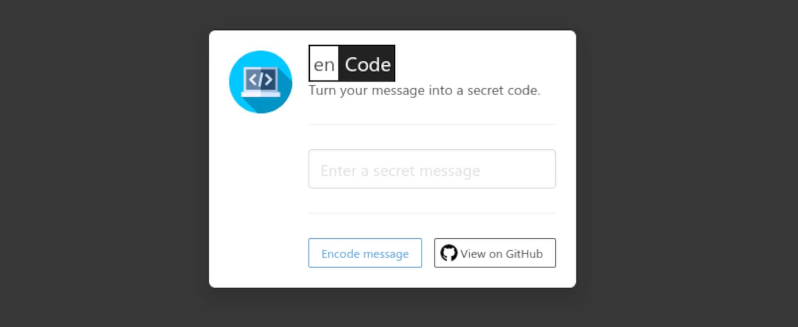

# enCode
A simple tool for creating secret messages. [Bulma](https://bulma.io/) is used for the styling.

View the live version [here](https://encode-sigma.vercel.app/index.html).

----------------------------------------------------------------------------

Enter a message that you would to turn into a secret code then click the `Encode message` button.

----------------------------------------------------------------------------

The message is then converted to a URL that you can share. Also, the URL is selected automatically. You can either press `ctrl` + `c` or click the `Copy to clipboard` button to copy the URL.

----------------------------------------------------------------------------

After clicking the `Copy to clipboard` button, a success tag will be displayed.

----------------------------------------------------------------------------

Opening the URL will display the secret message as show below:

----------------------------------------------------------------------------

The message is being decoded by reading the characters after the `hash` (#) symbol on the URL.

----------------------------------------------------------------------------

